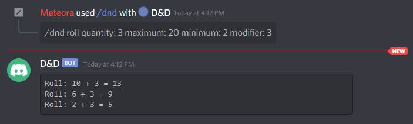

# serverless_discord_diceroll_bot

This is a simple bot that will return some dice roll results to dicord!

# Example 1:

# Example 2:

# Setup

To use serverless you'll need Node and the serverless framework installed.

https://www.serverless.com/framework/docs/providers/aws/guide/installation/

The goal for me was to make this so anyone with an AWS account can deploy the stack and get a bot working. The serverless.yml file attached will build all the infrastructure you need. It also injects the variable names you need into the lambda env variables.

My inspiration was this post on mendium. https://oozio.medium.com/serverless-discord-bot-55f95f26f743

They give really good examples to get set up with discord bots. Please check out that article if you get a chance its a great read and really help me.

There are some variables that you will have to provide yourself.

1. DISCORD_PUBLIC_KEY (Gotten from Discord devloper portal)
2. DEV_ACCOUNT_ID (Your AWS Account ID)

Place these into an env.json file in the same diretory as the serverless file. They will be read into the lambda environment variables.

These can be gotten from the Discord developer portal when you create your application and bot.

The other big thing you have to set up is the nacl lambda layer. Here is a guide you can follow for that.
https://medium.com/@geoff.ford_33546/creating-a-pynacl-lambda-layer-c3f2e1b6ff11

In there serverless YML you will need to enter the ARN for your own lambda layer.

# Deployment

Once you have everything set up just run

sls deploy --stage dev

# Registering Commands

I included a script that you can use to register commands. If you want the commands that work out of the box you should run the update_commands function in the register_commands.py file. Run this locally.

For this to work you need 2 env variables you will need to get from the discord developer portal. Create a .env file in the same directory as the script to and put the following into it.

1. bot_id='YOUR BOT ID'
2. bot_key='YOUR BOT KEY'

# Bot Commands

/dnd roll

## roll Options

### quantity:

required: True
description: Amount of dice you want to roll

### maximum:

required: True
description: Higher number on the die

### minimum:

required: False
description: Lowest number on the die

### modifier:

required: False
description: Any number you want to add After the roll.
